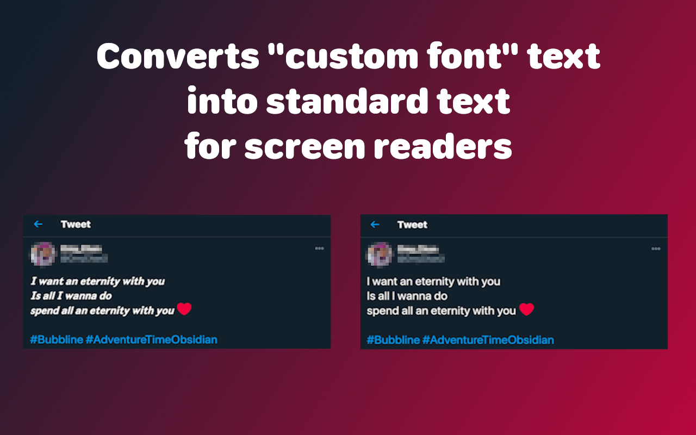

# readable

Readable is a Web Extension that converts "custom font" text on webpages to standard characters, which can be read as intended by screen readers.

[Example](https://jsfiddle.net/w029hxp4/1/)

